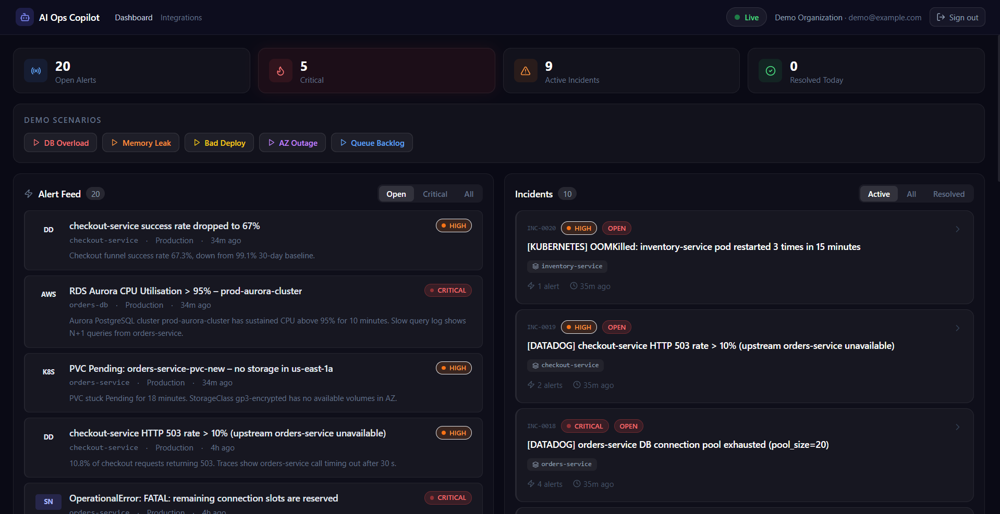
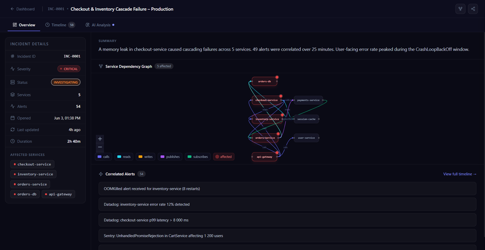
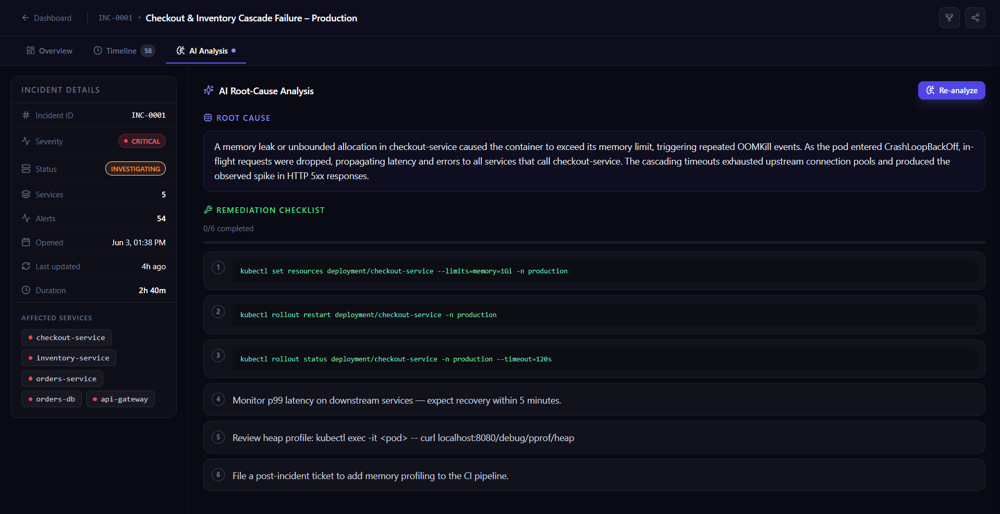
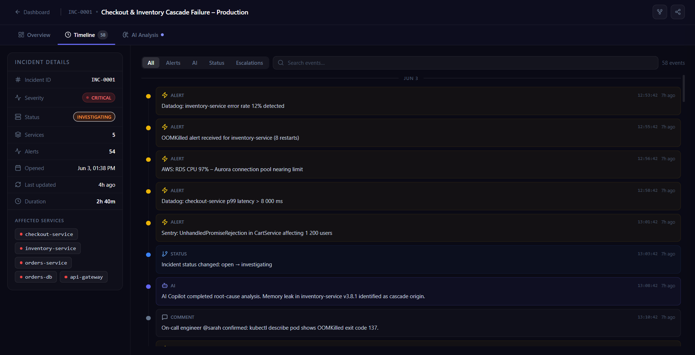
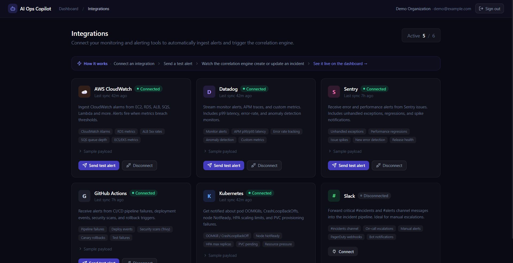

# AI Ops Copilot

> **Production-grade incident response platform** — real-time alert correlation, AI-powered root-cause analysis, and multi-tenant integrations, built with FastAPI + Next.js.

---

## The Problem

Modern engineering teams operate dozens of microservices that emit thousands of alerts per day. When something breaks, the on-call engineer faces:

- **Alert storm**: 50 alerts fire simultaneously — which one is the root cause?
- **Context switching**: Datadog, Sentry, AWS Console, Kubernetes dashboard — all open at once
- **Cognitive load**: Connecting the dots between a pod OOMKill, a latency spike, and a DLQ backlog is purely manual work
- **Slow MTTR**: Every minute of investigation costs revenue and user trust

**AI Ops Copilot** solves this by ingesting raw signals from any source, automatically correlating them into coherent incidents, and using AI to diagnose root cause and suggest remediation — all in under 30 seconds.

---

## Quick Start (Docker)

```bash
git clone https://github.com/ayaanjafri/ai-ops-copilot
cd ai-ops-copilot
cp .env.example .env
docker compose up
```

Open **http://localhost:3000** and sign in: `demo@example.com` / `demo1234`

> Optional: add `OPENAI_API_KEY=sk-...` to `.env` for real GPT-4o-mini analysis.  
> The platform works fully without it using a deterministic mock analyser.

---

## Features

### Core Platform
| Feature | Description |
|---|---|
| **Alert Ingestion** | REST endpoint accepts alerts from any source — AWS CloudWatch, Datadog, Sentry, GitHub Actions, Kubernetes, Slack |
| **Correlation Engine** | Stateless scoring engine (service graph + keyword similarity + recency) groups related alerts into incidents automatically |
| **AI Root-Cause Analysis** | OpenAI GPT-4o-mini analyzes incident context and generates plain-English root cause + remediation steps; falls back to a deterministic mock when no API key is set |
| **Real-time Dashboard** | WebSocket feed pushes alert/incident events to all connected clients instantly |
| **Incident Timeline** | Chronological audit trail of every event: alerts added, status changes, AI analyses, escalations |
| **Service Dependency Graph** | Interactive React Flow visualization of how affected services relate to each other |

### Integrations (Mock / Simulation)
| Integration | Capabilities |
|---|---|
| AWS CloudWatch | RDS, ALB, SQS, ECS alarms |
| Datadog | APM p99 latency, error-rate monitors, anomaly detection |
| Sentry | Unhandled exceptions, performance regressions, issue spikes |
| GitHub Actions | Pipeline failures, deploy events, security scans, rollbacks |
| Kubernetes | OOMKill, CrashLoopBackOff, node NotReady, HPA limits, PVC provisioning |
| Slack | #incidents channel, manual escalations, on-call paging |

Each integration has a **Send Test Alert** button that fires a realistic alert through the live correlation engine — no external accounts needed.

### Security & Multi-tenancy
- JWT authentication (7-day tokens, HS256)
- Organization-scoped data isolation — each org sees only its own alerts and incidents
- `bcrypt` password hashing via Passlib
- Middleware-enforced route protection (Next.js + FastAPI)

---

## Architecture

```
┌──────────────────────────────────────────────────────────────┐
│                    Browser  (Next.js 15)                      │
│                                                              │
│   /login   /signup   /dashboard   /incidents/:id             │
│   /integrations                                              │
│                                                              │
│   REST ──────────────────────────────────────────────────┐  │
│   WebSocket (ws://) ────────────────────────────────────┐ │  │
└────────────────────────────────────────────────────────────┘ │
                    │ HTTP / WS                                   │
                    ▼                                             │
┌──────────────────────────────────────────────────────────────┤
│                 FastAPI  (Uvicorn)  :8000                      │
│                                                              │
│  ┌─────────────┐  ┌──────────────┐  ┌────────────────────┐  │
│  │  Auth       │  │  Alerts      │  │  Incidents         │  │
│  │  /auth/*    │  │  POST · GET  │  │  GET · PATCH       │  │
│  │  JWT/bcrypt │  │  demo-gen    │  │  analyze · graph   │  │
│  └─────────────┘  └──────┬───────┘  └────────────────────┘  │
│                           │                                   │
│  ┌────────────────────────▼──────────────────────────────┐   │
│  │              Correlation Engine  (stateless)           │   │
│  │  Rule 1: same service + env within 30-min window      │   │
│  │  Rule 2: service dependency graph overlap              │   │
│  │  Rule 3: keyword Jaccard similarity ≥ 0.25            │   │
│  │  Rule 4: severity escalation promotion                │   │
│  └────────────────────────┬──────────────────────────────┘   │
│                            │ creates / updates                │
│  ┌─────────────────────────▼─────────────────────────────┐   │
│  │               AI Analysis Pipeline                     │   │
│  │  OpenAI GPT-4o-mini  ──▶  deterministic mock fallback │   │
│  │  root_cause · remediation_steps · confidence score    │   │
│  └────────────────────────────────────────────────────────┘   │
│                                                              │
│  ┌────────────────────────────────────────────────────────┐   │
│  │              WebSocket Broadcast Manager               │   │
│  │  alert.created · incident.created                     │   │
│  │  incident.updated · incident.escalated                │   │
│  └────────────────────────────────────────────────────────┘   │
└──────────────────────────────────────────────────────────────┘
          │ async writes              │ task queue
          ▼                           ▼
┌──────────────────┐      ┌─────────────────────────┐
│  PostgreSQL 16   │      │  Redis 7  +  Celery 5   │
│  SQLAlchemy 2    │      │                         │
│  (asyncpg)       │      │  queues: alerts         │
│                  │      │          analysis       │
│  alerts          │      │          default        │
│  incidents       │      │                         │
│  incident_events │      │  tasks: process_alert   │
│  organizations   │      │         analyze_bg      │
│  users           │      │         demo_alerts     │
│  memberships     │      │         heartbeat       │
│  integrations    │      └─────────────────────────┘
└──────────────────┘
```

---

## Tech Stack

### Backend
| Layer | Technology | Rationale |
|---|---|---|
| API framework | **FastAPI 0.115** | Async-first, auto-OpenAPI docs, Pydantic v2 validation |
| ORM | **SQLAlchemy 2 async** | Type-safe, asyncpg driver, connection pooling |
| Database | **PostgreSQL 16** | JSONB for raw payloads, ARRAY for service lists |
| Cache / Broker | **Redis 7** | Celery broker + result backend + pub/sub |
| Background jobs | **Celery 5** | 3 priority queues, Beat scheduler, retry logic |
| Auth | **python-jose + passlib** | HS256 JWT, bcrypt hashing |
| AI | **OpenAI SDK** + mock | GPT-4o-mini with deterministic fallback — always works |
| Real-time | **WebSocket** native | Server-push delta events + initial state snapshot |
| Testing | **pytest-asyncio + HTTPX** | In-memory SQLite, full async test client |

### Frontend
| Layer | Technology | Rationale |
|---|---|---|
| Framework | **Next.js 15 App Router** | RSC, streaming, server-side auth middleware |
| UI | **React 19 + TypeScript** | Strict types across the full component tree |
| Styling | **Tailwind CSS 3** | Utility-first, custom dark theme, responsive grid |
| Graphs | **React Flow (@xyflow/react)** | Interactive service dependency visualization |
| Auth | **JWT** (localStorage + cookie) | Middleware route guards + client-side state |

---

## Project Structure

```
ai-ops-copilot/
├── backend/
│   ├── app/
│   │   ├── api/v1/          # Route handlers (alerts, incidents, auth, integrations…)
│   │   ├── core/            # Config, DB engine, security helpers, seed data
│   │   ├── crud/            # Async DB operations — no business logic
│   │   ├── models/          # SQLAlchemy ORM (Organization, User, Alert, Incident…)
│   │   ├── schemas/         # Pydantic request/response models
│   │   ├── services/        # Correlation engine, AI pipeline, integration alerts
│   │   └── workers/         # Celery tasks + Beat schedule
│   └── tests/
│       ├── conftest.py           # In-memory SQLite, auth override fixture
│       ├── test_auth.py          # Signup, login, JWT claims, org isolation
│       ├── test_alerts.py        # Alert CRUD, filtering
│       ├── test_incidents.py     # Incident CRUD, status events
│       ├── test_correlation_engine.py  # 37 engine unit + integration tests
│       ├── test_analysis.py      # MockProvider patterns, AI pipeline
│       ├── test_integrations.py  # Connect, test-alert, org scope
│       └── test_health.py
├── frontend/
│   └── src/
│       ├── app/             # Next.js pages (dashboard, incidents, integrations, auth)
│       ├── components/      # AlertFeed, IncidentCard, IncidentDetail, StatsBar…
│       ├── hooks/           # useWebSocket (auto-reconnect, exponential backoff)
│       └── lib/             # API client, auth utils, TypeScript types
├── docker-compose.yml       # 7-service stack
└── .env.example
```

---

## Running Tests

```bash
cd backend

# Full suite (~80 tests, ~15 seconds on SQLite)
pytest -v

# By module
pytest tests/test_auth.py -v
pytest tests/test_correlation_engine.py -v
pytest tests/test_integrations.py -v
pytest tests/test_analysis.py -v

# With coverage
pytest --cov=app --cov-report=term-missing
```

---

## Demo Flow

### 1. Authenticate
Visit **http://localhost:3000**, sign in with the demo account or create a new organization.

### 2. Trigger a correlated incident
Click **DB Overload** in the Demo Scenarios bar. Five alerts fire in sequence:  
RDS CPU spike → connection pool exhaustion → Sentry exception → checkout 503s → ALB latency spike.  
The correlation engine groups all five into **one incident** automatically.

### 3. Run AI analysis
Open the incident → click **Analyse with AI**. In seconds you see:
- Plain-English root cause
- Confidence score (0–100%)
- Risk level (low / medium / high / critical)
- Numbered remediation steps
- Reconstructed alert timeline

### 4. Explore the timeline
Switch to the **Timeline** tab to see every event with type filters (Alerts / AI / Status / Escalations) and full-text search.

### 5. Inspect raw payloads
Click any alert in the timeline → slide-out drawer shows the full raw JSON payload with an interactive collapsible tree viewer.

### 6. View the service graph
Switch to **Graph** → see which services are affected and how they depend on each other in an interactive React Flow canvas.

### 7. Test an integration
Visit **http://localhost:3000/integrations** → connect **Kubernetes** → **Send Test Alert**. A realistic OOMKill alert fires and appears live in the dashboard feed.

### 8. Verify org isolation
Sign up as a second user with a different email and org name. They see zero alerts and incidents — complete multi-tenant isolation.

---

## API Reference

Full interactive Swagger UI: **http://localhost:8000/docs**

| Auth | Endpoint | Description |
|---|---|---|
| ❌ | `POST /api/v1/auth/signup` | Create org + user, return JWT |
| ❌ | `POST /api/v1/auth/login` | Authenticate, return JWT |
| ✅ | `GET /api/v1/auth/me` | Current user + org info |
| ✅ | `POST /api/v1/alerts` | Ingest alert (sync or `?async=true`) |
| ✅ | `GET /api/v1/alerts` | List alerts (filters: status, source, service, since) |
| ✅ | `GET /api/v1/alerts/{id}` | Single alert |
| ✅ | `POST /api/v1/alerts/demo-generate` | Fire a scenario (5 available) |
| ✅ | `GET /api/v1/incidents` | List incidents |
| ✅ | `GET /api/v1/incidents/{id}` | Incident + full event timeline |
| ✅ | `PATCH /api/v1/incidents/{id}` | Update status / root cause / severity |
| ✅ | `POST /api/v1/incidents/{id}/analyze` | Run AI root-cause analysis |
| ✅ | `GET /api/v1/incidents/{id}/graph` | Service dependency graph |
| ✅ | `GET /api/v1/integrations` | List org's integrations |
| ✅ | `POST /api/v1/integrations` | Create integration |
| ✅ | `PATCH /api/v1/integrations/{id}` | Connect / disconnect |
| ✅ | `POST /api/v1/integrations/{id}/test-alert` | Fire realistic test alert |
| ❌ | `WS /api/v1/ws` | Real-time event stream |
| ❌ | `GET /api/v1/health` | Health check (Postgres + Redis) |

---

## Configuration Reference

| Variable | Default | Description |
|---|---|---|
| `SECRET_KEY` | `change-me` | JWT signing secret — use `openssl rand -hex 32` in prod. App refuses to start with default in production. |
| `DATABASE_URL` | `postgresql+asyncpg://...` | Async PostgreSQL DSN |
| `REDIS_URL` | `redis://localhost:6379/0` | Redis DSN |
| `CORS_ORIGINS` | `["http://localhost:3000"]` | Allowed CORS origins — must list actual frontend URL(s) in production |
| `OPENAI_API_KEY` | *(empty)* | Leave blank to use the deterministic mock analyser |
| `OPENAI_MODEL` | `gpt-4o-mini` | Any OpenAI chat-completions model |
| `AUTO_ANALYZE_NEW_INCIDENTS` | `false` | Queue AI analysis for every new incident |
| `DEMO_PERIODIC_ALERTS` | `false` | Beat scheduler fires random alerts on a timer |
| `DEMO_ALERT_INTERVAL_SECONDS` | `120` | Interval for periodic demo alerts |
| `ACCESS_TOKEN_EXPIRE_MINUTES` | `10080` | JWT TTL (default 7 days) |
| `CELERY_CONCURRENCY` | `4` | Worker processes per container |
| `DEBUG` | `false` | Enable SQLAlchemy query logging |

---

## Screenshots

**Main Dashboard** — live alert feed, incident list, stats bar, and one-click demo scenarios



**Incident Detail + Service Dependency Graph** — affected services highlighted in the interactive React Flow canvas, 54 correlated alerts, full audit timeline



**AI Root-Cause Analysis** — GPT-4o-mini diagnosis with actionable remediation checklist



**Incident Timeline** — chronological audit trail with type filters (Alerts / AI / Status / Escalations)



**Integrations** — connect monitoring sources and fire realistic test alerts through the live correlation engine



---

## Future Improvements

| Area | Improvement |
|---|---|
| **Auth** | OAuth2 (Google / GitHub SSO), team invitations, RBAC (admin / member / viewer) |
| **Integrations** | Real OAuth flows — PagerDuty, OpsGenie, Grafana, Prometheus, Datadog webhooks |
| **AI** | Fine-tuned model on historical incident data, cost tracking per org, analyst feedback loop |
| **Correlation** | Embedding-based similarity, historical pattern matching, anomaly baseline |
| **Runbooks** | Auto-attach runbooks by incident type, one-click kubectl / aws-cli remediation |
| **SLOs** | Error budget tracking, burn-rate alerting, SLO compliance dashboard |
| **Migrations** | Alembic migration scripts (currently `create_all` on startup) |
| **Observability** | OpenTelemetry tracing, Prometheus `/metrics` endpoint, Grafana dashboards |
| **Collaboration** | Real-time war room (comments, @mentions, status page integration) |
| **Mobile** | PWA / React Native companion for on-call engineers |

---

## License

MIT — see [LICENSE](LICENSE).

---

*Built to demonstrate full-stack async architecture, real-time systems, AI integration, and production-grade software engineering practices.*
